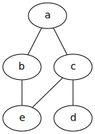

A fost implementată partea obligatorie și opțională.

Exemplu de utilizare:

```
register a
register b
register c
register d
register e
login a
friend b c
login c
friend e d
login e
friend b
send a message
login c
read // e: a message
stop
exit
```

Graful va fi afișat pe portul 8080:


