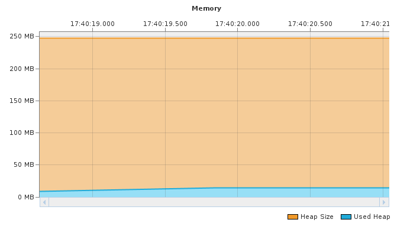
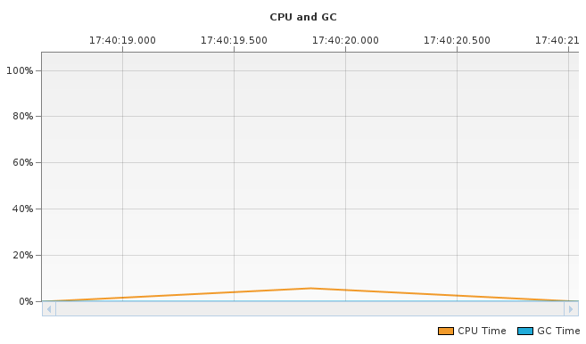

A fost adăugată partea obligatorie, opțională și bonusul.

Au fost identificate următoarele hot-spot-uri:

| Name                                                                      | Self Time (CPU) | Total Time (CPU) |
| ------------------------------------------------------------------------- | --------------- | ---------------- |
| lab2.transportation.algorithm.vogel.VogelMatrix.getColumnDifference (int) | 45.6 ms (15.6%) | 45.6 ms (0.9%)   |
| lab2.transportation.algorithm.vogel.VogelMatrix.getRowDifference (int)    | 36.3 ms (12.4%) | 36.4 ms (0.7%)   |
| lab2.transportation.algorithm.vogel.VogelMatrix.getNextCell ()            | 30.3 ms (10.4%) | 129 ms (2.7%)    |
